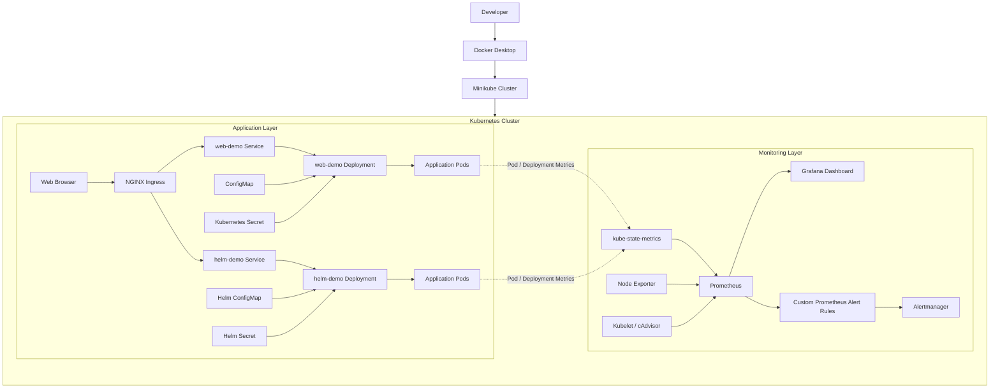

# Kubernetes Monitoring Platform — Architecture

```mermaid
flowchart TB
    DEV["Developer"] --> DOCKER["Docker Desktop"]
    DOCKER --> MINI["Minikube Cluster"]

    subgraph K8S["Kubernetes Cluster"]

        subgraph APP["Application Layer"]
            USER["Web Browser"] --> ING["NGINX Ingress"]

            ING --> SVC1["web-demo Service"]
            ING --> SVC2["helm-demo Service"]

            SVC1 --> DEP["web-demo Deployment"]
            SVC2 --> HELM["helm-demo Deployment"]

            DEP --> POD1["Application Pods"]
            HELM --> POD2["Application Pods"]

            CM["ConfigMap"] --> DEP
            SEC["Kubernetes Secret"] --> DEP

            HCM["Helm ConfigMap"] --> HELM
            HSEC["Helm Secret"] --> HELM
        end

        subgraph MON["Monitoring Layer"]
            KSM["kube-state-metrics"]
            NODE["Node Exporter"]
            KUBELET["Kubelet / cAdvisor"]

            PROM["Prometheus"]
            GRAF["Grafana Dashboard"]
            RULES["Custom Prometheus Alert Rules"]
            AM["Alertmanager"]

            KSM --> PROM
            NODE --> PROM
            KUBELET --> PROM

            PROM --> GRAF
            PROM --> RULES
            RULES --> AM
        end

        POD1 -. "Pod / Deployment Metrics" .-> KSM
        POD2 -. "Pod / Deployment Metrics" .-> KSM
    end

    MINI --> K8S
```
